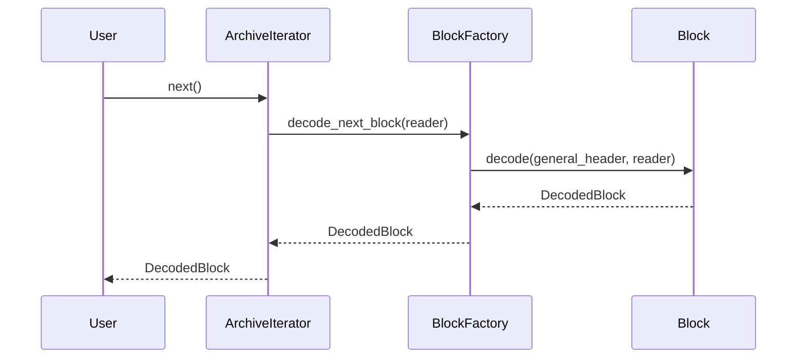

# Architecture: Block-Oriented Design

This document outlines the refactored, object-oriented architecture for `rar-rs`. The new design improves maintainability and extensibility by encapsulating block-specific logic within dedicated objects.

## Component Overview

The core of the new architecture is the `Block` trait, which defines a common interface for all RAR block types. Each block type is now a struct that implements this trait, containing its own data and the logic for encoding and decoding itself.

### Key Components:

1.  **`block.rs`**:
    *   **`Block` Trait:** Defines the `encode` and `decode` interface that all block types must implement. This promotes a uniform approach to handling different blocks.
    *   **`BaseBlock` Struct:** A struct that holds the `GeneralBlockHeader`, which is common to all block types. This avoids code duplication and centralizes the management of the general header.

2.  **`structures.rs`**:
    *   Each block type struct (e.g., `MainArchiveHeader`, `FileHeader`) now embeds a `BaseBlock` and implements the `Block` trait.
    *   The encoding and decoding logic for each block type has been moved from the `decoder` and `encoder` modules into the `Block` trait implementation for the respective struct. This encapsulates the logic for each block type within the struct itself.

3.  **`archive.rs`**:
    *   The `Archive` struct's iterator now uses the `Block::decode` method to read the next block from the stream. This simplifies the `Archive` implementation and makes it more generic.

## Control Flow

The control flow for decoding is now more object-oriented. The `Archive` iterator reads the general block header, determines the block type, and then uses the `Block::decode` method to let the appropriate block type decode itself.

### Mermaid Diagram: Decoding Process

