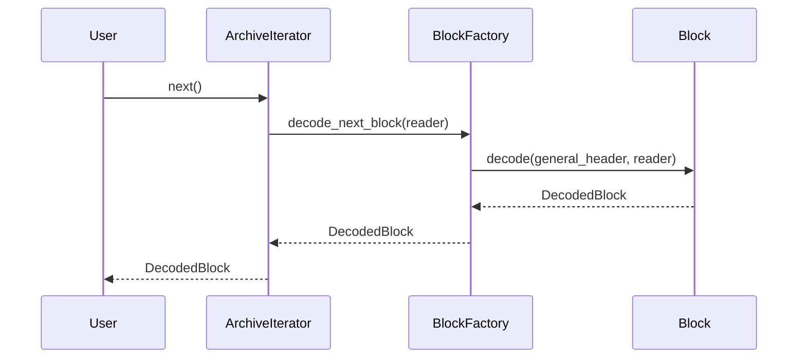

# Architecture: Block-Oriented Design

This document outlines the refactored, object-oriented architecture for `rar-rs`. The new design improves maintainability and extensibility by encapsulating block-specific logic within dedicated objects.

## Component Overview

The core of the new architecture is the `Block` trait, which defines a common interface for all RAR block types. Each block type is now a struct that implements this trait, containing its own data and the logic for encoding and decoding itself.

### Key Components:

1.  **`structures` module**: This module now contains all the data structures for the project, organized into submodules.
    *   **`block.rs`**:
        *   **`Block` Trait:** Defines the `encode` and `decode` interface that all block types must implement. This promotes a uniform approach to handling different blocks. The `encode` method is responsible for calculating the `header_size` and writing the entire block, including the general header.
        *   **`BaseBlock` Struct:** A struct that holds the `GeneralBlockHeader`, which is common to all block types. This avoids code duplication and centralizes the management of the general header.
    *   **`main_archive_header.rs`, `file_header.rs`, etc.**: Each of these files contains a block type struct (e.g., `MainArchiveHeader`, `FileHeader`) that embeds a `BaseBlock` and implements the `Block` trait.

2.  **`archive.rs`**:
    *   The `Archive` struct's iterator now uses the `Block::decode` method to read the next block from the stream. It also handles advancing the reader past any data associated with a block.

## Control Flow

The control flow for decoding is now more object-oriented. The `Archive` iterator reads the general block header, determines the block type, and then uses the `Block::decode` method to let the appropriate block type decode itself.

### Mermaid Diagram: Decoding Process

