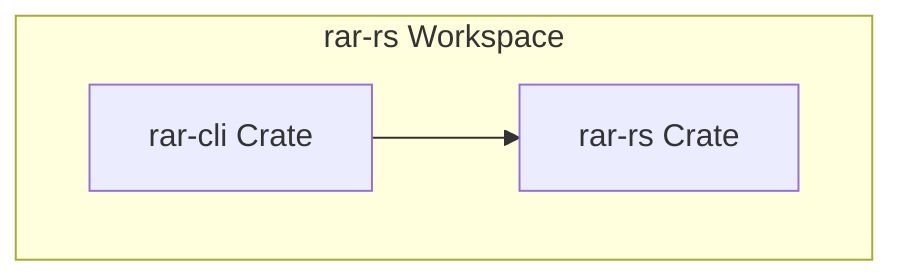
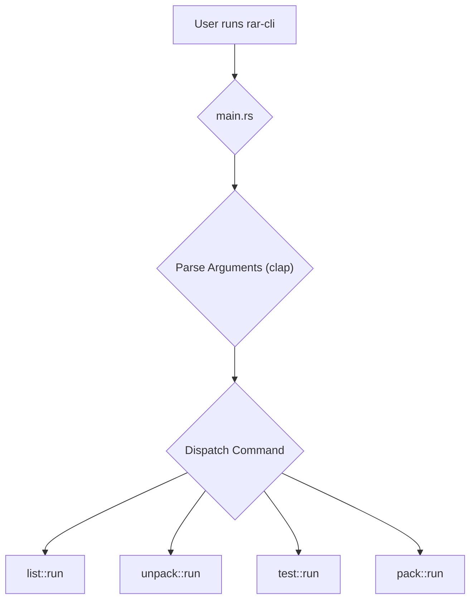
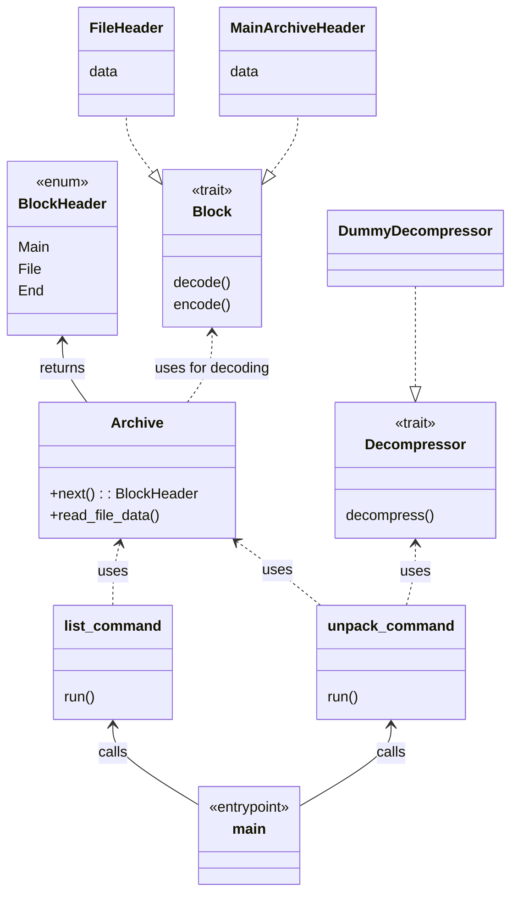

# Architecture: `rar-cli`

This document outlines the architecture for the `rar-cli` command-line utility.

## Workspace Architecture

The project is structured as a Cargo workspace to manage the `rar-rs` library and the `rar-cli` binary independently.

*   **`rar-rs` (Library):** The core library containing all logic for RAR file parsing, decompression, and encoding.
*   **`rar-cli` (Binary):** A command-line utility that acts as a user-friendly wrapper around the `rar-rs` library.

This separation of concerns allows the `rar-rs` library to be used by other applications, while the `rar-cli` provides a concrete implementation for end-users.

## CLI Internal Architecture

The `rar-cli` utility will use the `clap` crate for command-line argument parsing. The main entry point (`main.rs`) will be responsible for parsing these arguments and dispatching the appropriate command to a dedicated module.

### Key Components:

*   **`main.rs`**: The application entry point. Its primary role is to initialize the argument parser and call the correct command handler.
*   **Command Modules (`list.rs`, `unpack.rs`, etc.)**: Each command will be implemented in its own module. This keeps the codebase organized and easy to maintain. Each module will contain a `run` function that takes the parsed arguments and executes the command's logic.

### Control Flow

The control flow is initiated by the user running a command. `clap` parses the input, and `main.rs` matches on the command to delegate the work to the appropriate module.
 

## Class Relationships

The following diagram shows the high-level relationships between the main structs and traits in the workspace.

