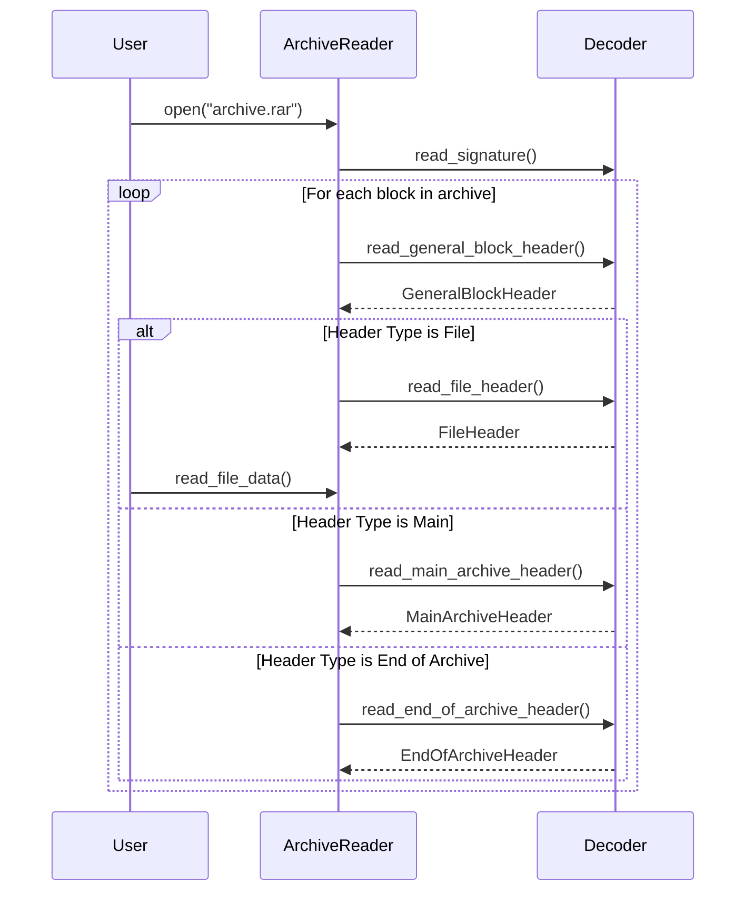

# Architecture: Decoder

This document outlines the architecture for the `rar-rs` decoder, which is responsible for parsing the block-based structure of a RAR 5.0 archive.

## Component Overview

The decoder is designed as a set of functions that operate on a `std::io::Read` source. This approach keeps the decoding logic separate from the underlying data source (e.g., file, network stream), promoting flexibility and testability.

### Key Components:

1.  **`structures.rs`**: Contains the Rust struct definitions that mirror the RAR 5.0 binary format as described in `specs.md`. These are plain data objects with no logic.
2.  **`decoder.rs`**: Contains the parsing logic to read from a byte stream and populate the structs in `structures.rs`. The `decoder` module provides functions to read and parse each block type.

## Control Flow

The primary control flow for decoding involves reading a block, identifying its type, and then dispatching to a type-specific parser.

### Mermaid Diagram: Decoding Process

