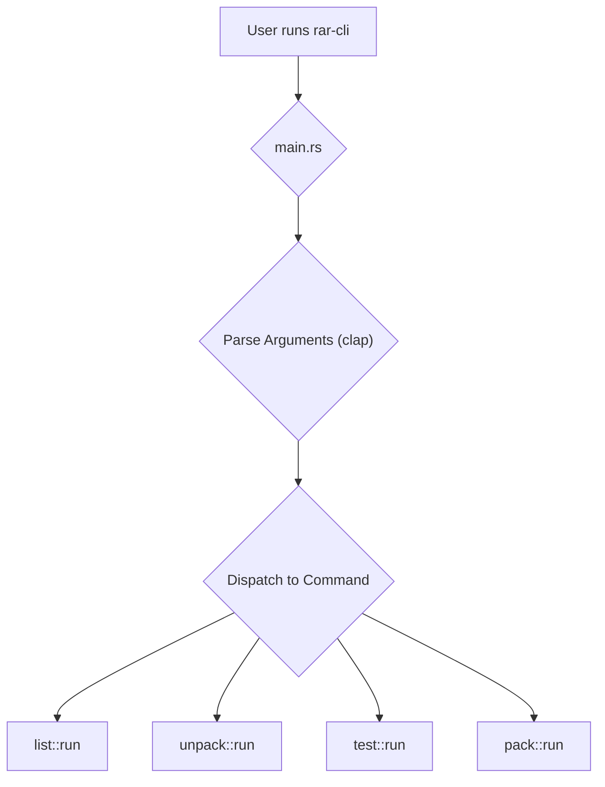

# Project Plan: `rar-cli` Implementation

This document outlines the development plan for the `rar-cli` command-line utility.

## 1. Project Structure

To accommodate both the library and the command-line utility, we will restructure the project into a Cargo workspace.

```
rar-rs/
├── Cargo.toml         # Workspace definition
├── rar-rs/            # The library crate (existing code)
│   ├── Cargo.toml
│   └── src/
└── rar-cli/           # The new binary crate
    ├── Cargo.toml
    └── src/
        └── main.rs
```

## 2. Dependencies

The `rar-cli` crate will use the following dependencies:

*   **`clap`**: For parsing command-line arguments.
*   **`rar-rs`**: The library crate we are developing.
*   **`log` / `env_logger`**: For logging and debugging.

## 3. Architecture

The CLI's architecture will be straightforward. The `main.rs` file will be responsible for parsing command-line arguments and dispatching to the appropriate command handler. Each command will be implemented in its own module.

### Mermaid Diagram: CLI Control Flow



## 4. Implementation Phases

We will implement the CLI in the following phases:

1.  **Phase 1: Workspace Setup**
    *   Create the workspace structure.
    *   Move the existing library code into the `rar-rs` subdirectory.
    *   Create the `rar-cli` binary crate.
    *   Add `clap` as a dependency.

2.  **Phase 2: Implement `list` Command**
    *   Define the command-line arguments for `list`.
    *   Implement the logic to open a RAR archive and iterate through its file headers, printing the file names.

3.  **Phase 3: Implement `unpack` Command**
    *   Define the command-line arguments for `unpack`.
    *   Implement the logic to extract files from a RAR archive. This will initially only work for uncompressed files.

4.  **Phase 4: Implement `test` Command**
    *   Define the command-line arguments for `test`.
    *   Implement the logic to test the integrity of files in an archive by attempting to decompress them without writing to disk.

5.  **Phase 5: Implement `pack` Command**
    *   Define the command-line arguments for `pack`.
    *   **Note:** This is a significant undertaking that will require a robust encoding and compression implementation in the `rar-rs` library. This phase will be scheduled after the core decompression functionality is complete.
