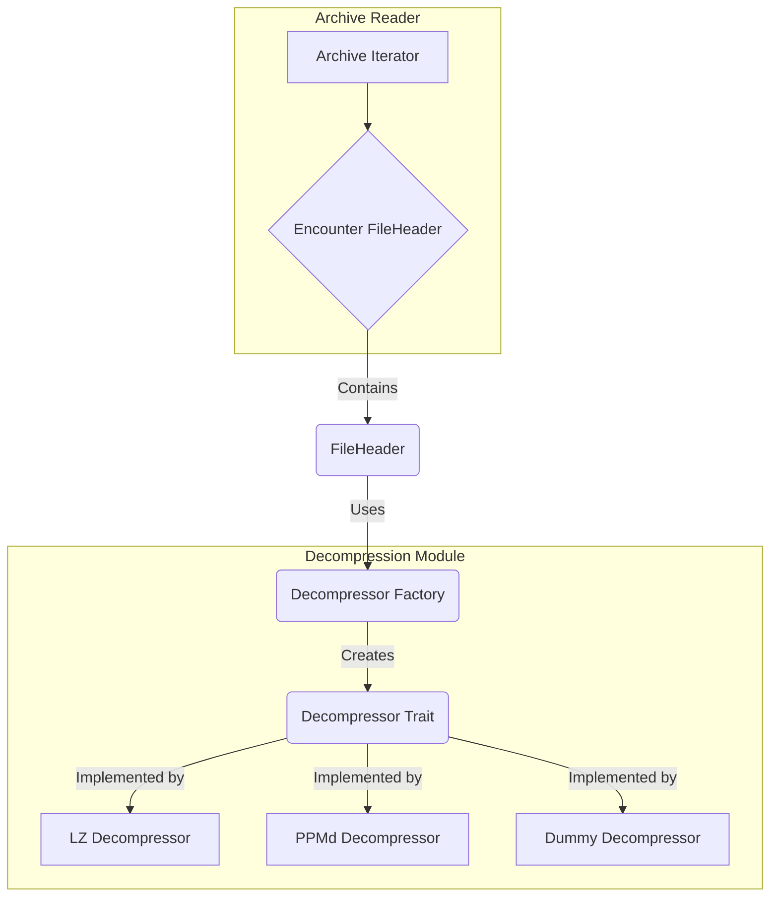

# Plan: Decompressor Implementation

This plan outlines the steps to create a `Decompressor` system that is decoupled from the main archive parsing logic. We will use a trait-based approach to ensure the design is extensible for future compression algorithms.

### 1. Define the `Decompressor` Trait

*   **Create a new module:** A new file will be created at `src/decompression.rs` to house all decompression-related logic.
*   **Define the `Decompressor` trait:** This trait will establish the contract for all decompression algorithms.
    ```rust
    // In src/decompression.rs
    pub enum DecompressionError {
        InvalidFormat,
        // Other potential errors
    }

    pub trait Decompressor {
        fn decompress(&self, data: &[u8]) -> Result<Vec<u8>, DecompressionError>;
    }
    ```
*   **Create a `DummyDecompressor`:** For initial testing, we will create a simple struct that implements the `Decompressor` trait but does nothing. This will allow us to integrate the trait into the system before implementing any real algorithms.

### 2. Create a Decompressor Factory

*   **Create a factory function:** A factory function, `get_decompressor()`, will be added to `src/decompression.rs`.
*   **Purpose:** This function will be responsible for creating and returning the correct `Decompressor` implementation based on the compression method specified in a file's header. This isolates the algorithm selection logic.
    ```rust
    // In src/decompression.rs
    use crate::structures::file_header::FileHeader; // Assuming path

    pub fn get_decompressor(file_header: &FileHeader) -> Box<dyn Decompressor> {
        // Logic to inspect file_header.compression_info and return
        // the appropriate decompressor. For now, it will return DummyDecompressor.
        Box::new(DummyDecompressor)
    }
    ```

### 3. Integrate with the `Archive` Reader

*   **Modify `FileHeader`:** Add a new method to the `FileHeader` struct called `decompress_data`. This method will be responsible for using the factory to get the correct decompressor and then invoking it.
*   **Update the main loop:** The main archive reading loop will be updated to call this new method when it encounters a `FileHeader` to extract and decompress the file's contents.

### Architectural Diagram
 
This diagram illustrates how the new components will interact.


