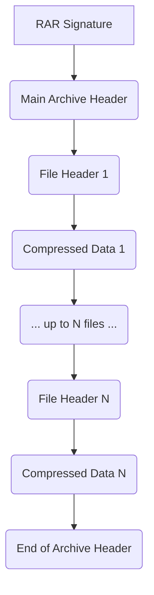
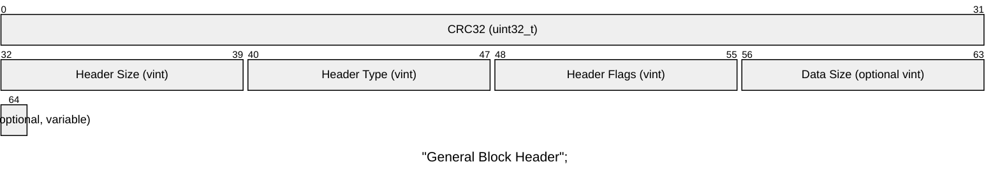
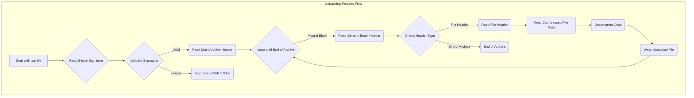

# WinRAR 5.0 Binary Format Specification

## Introduction

This document details the technical specification for the RAR 5.0 archive format. RAR 5.0 is a proprietary, block-based system for data compression and archiving, introduced with WinRAR 5.0. It is not backward compatible with previous versions (RAR 4.x).

## Overall Archive Structure

A RAR 5.0 archive begins with a fixed 8-byte signature, followed by a series of variable-length blocks. The primary blocks are the Main Archive Header and one or more File Headers.

The logical layout is as follows:

1.  **RAR Signature:** A fixed marker identifying the file as a RAR 5.0 archive.
2.  **Main Archive Header:** Contains global information about the archive. This block can be encrypted.
3.  **File Header & Data:** A block describing a single file or directory, followed by its compressed data. This pair repeats for each archived item.
4.  **(Optional) Service Headers:** Contains supplementary data.
5.  **End of Archive Header:** A special block marking the end of the archive.

#### Mermaid Diagram of Archive Structure

## General Block Structure

Each block in a RAR 5.0 archive (except the signature) is preceded by a generic header defining its type, flags, and size.

**Variable-Length Integers (vint):** A space-saving encoding where each byte uses 7 bits for data and the most significant bit as a continuation flag (1 for continue, 0 for last byte).

## Key Block Types

### RAR Signature (Marker Block)

*   **Signature:** `0x52 0x61 0x72 0x21 0x1A 0x07 0x01 0x00`
*   **ASCII:** `Rar!....`
*   This is a fixed 8-byte block at the very beginning of the file.

### Main Archive Header

*   **Header Type:** 1
*   **Description:** Contains global properties for the archive.
*   **Block-Specific Fields:**
    *   **Archive Flags:** vint (Bitmask of archive properties, e.g., Volume, Solid).
    *   **Volume Number:** vint (Optional, present if Volume flag is set).
    *   **Locator Record:** byte[] (Optional service data).

### File Header

*   **Header Type:** 2
*   **Description:** Provides metadata for a single file or directory.
*   **Block-Specific Fields:**
    *   **File Flags:** vint (Bitmask of file properties).
    *   **Unpacked Size:** vint (Original uncompressed size).
    *   **File Attributes:** vint (Host OS-specific attributes).
    *   **Modification Time:** uint32_t (Optional Unix timestamp).
    *   **File CRC32:** uint32_t (Optional checksum of uncompressed data).
    *   **Compression Info:** vint (Compression algorithm and host OS).
    *   **File Name Length:** vint (Length of File Name in bytes).
    *   **File Name:*`* byte[] (File name in UTF-8).
    *   **(Optional) Symlink:** byte[] (Target path for symbolic links).

### End of Archive Header

*   **Header Type:** 5
*   **Description:** Marks the end of the archive.
*   **Block-Specific Fields:**
    *   **End Archive Flags:** vint (Bitmask, e.g., indicates if not the last volume).

## Data Integrity and Encryption

*   **CRC32:** Used for header and uncompressed data integrity checking.
*   **Encryption:** RAR 5.0 uses AES-256 in CBC mode. Header encryption, if enabled, encrypts all blocks after the signature.

#### Mermaid Diagram of Unpacking Process Flow

